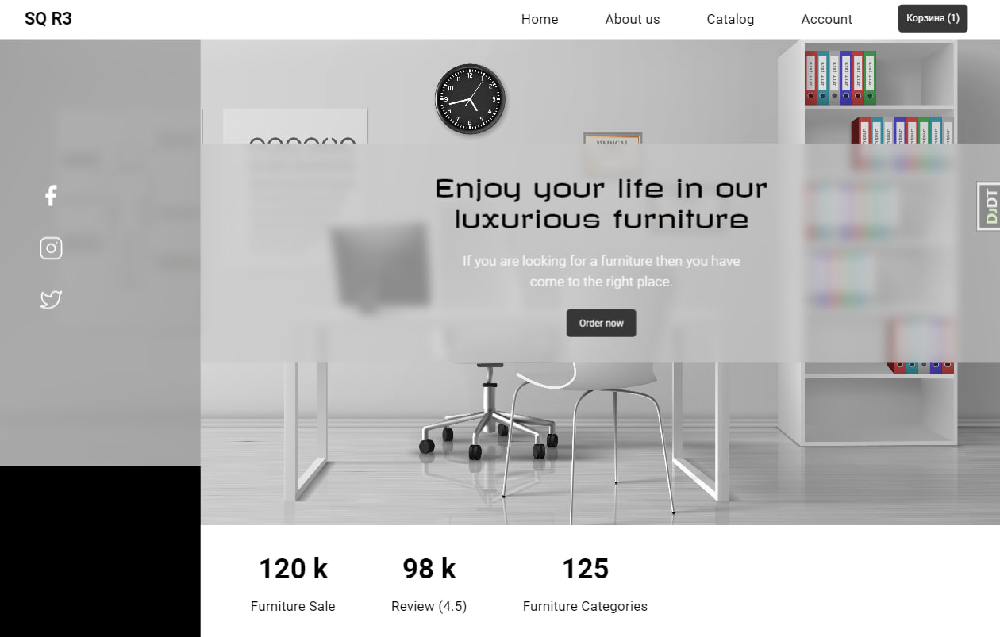

# Интернет-магазин на Django

Интернет-магазин с каталогом товаров, личным кабинетом пользователя, корзиной и оформлением заказа. Проект реализован с использованием **Django** и подключением к базе данных **PostgreSQL**.

## Ключевые особенности, реализованные и используемые в проекте:

- Подключение к PostgreSQL данных для хранения данных.
- Возможность фильтровать товары по категориям и другим параметрам, а также искать товары по названию с выделением результатов.
- Использование фикстур для загрузки тестовых данных в базу данных.
- Реализация с использованием классов представления для обработки запросов.
- Миксины для обработки логики.
- Реализована возможность редактировать корзину без перезагрузки страницы с использованием **JQuery**.
- Написание кастомных тэгов для шаблонов.
- Индивидуальная настройка для удобного управления контентом через административную панель.
- Сессии для неавторизованных пользователей*
- Кэширование данных для ускорения работы с базой данных.

## Технологии
- Python 3.x
- Django
- PostgreSQL
- JQuery
- HTML/CSS

